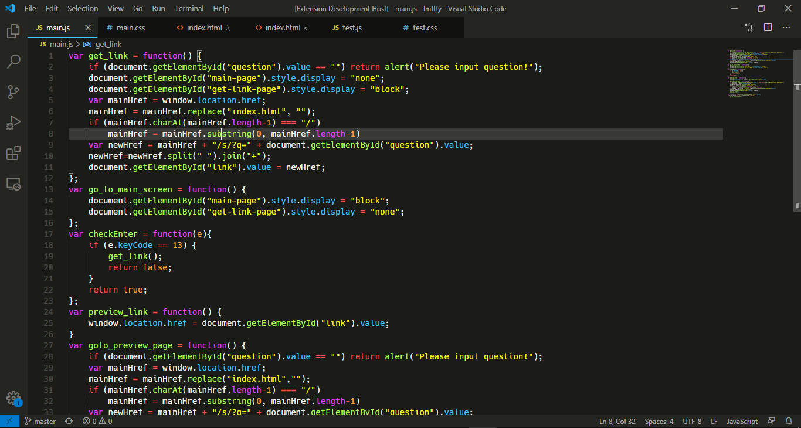

# Neutron Theme
A dark and colorful theme, a mixture of Laetus Blue and Visual Studio Code dark theme

# Install
1. Go to  `View -> Command Palette`  or press  `Ctrl+Shift+P`
2. Then enter `Install Extension`
3. Write  `Neutron Theme`
4. Select it or press Enter to install

# Screenshots

